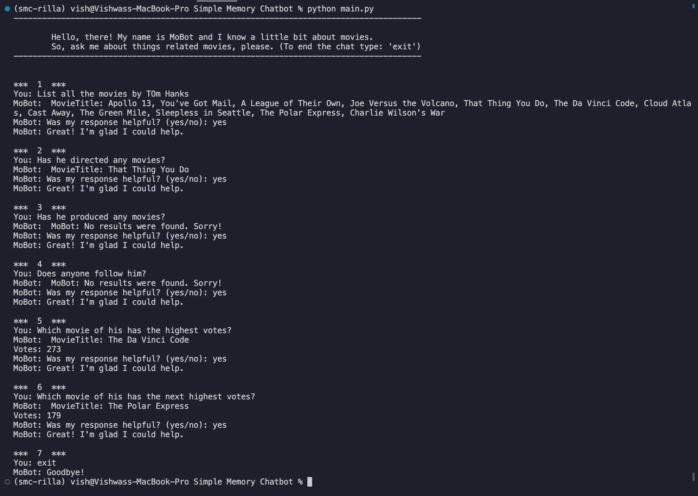
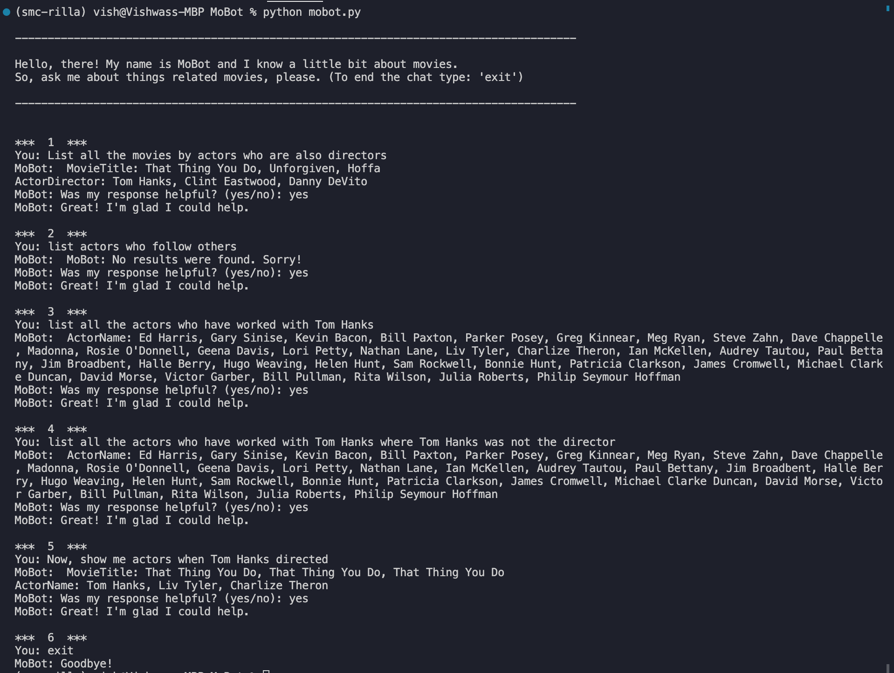

# MoBot: A Simple Memory Chatbot Project

## Introduction

This document provides a detailed overview of MoBOt, a Simple Memory Chatbot project, designed to interact with users by answering questions-- dynamically generating queries in Cypher format to interact with a Neo4J database and extract answers for user queries in natural language. The chatbot integrates OpenAI's GPT models for enhanced conversation and query generation capabilities, including the use of conversational context for co-reference resolution.

---

## Project Objectives

1. **Terminal-Based Interaction**: Develop a chatbot capable of running directly in a terminal, providing an interactive command-line interface for users.

2. **Neo4J Database Integration**: Create a sandbox Neo4J database using the link [here](https://neo4j.com/developer/example-data/). The chatbot should be able to query and answer questions from the “Movie” toy database.

3. **Dynamic User Queries**: The chatbot must seek input from users about their questions or the information they seek, demonstrating the ability to understand and respond to a wide range of queries related to the database content.

4. **Memory Functionality**: Implement simple memory capabilities, allowing the chatbot to recall and reference previous messages within the conversation. This enhances the chatbot's ability to maintain context and continuity in discussions.

5. **Feedback Mechanism**: Incorporate a feedback mechanism within the chatbot's interaction flow, asking users to rate the quality of responses received. This feedback should influence the chatbot's future responses and learning, improving over time.

6. **Language and Tools**: Use any programming language of your choice, but we recommend Python. Feel free to use a chat bot framework such as LangChain, Rasa, or ChatterBot to build your chat bot.

7. **Advanced Language Models** (Optional): Integrate advanced language models, specifically recommending GPT-4 or GPT-4-Turbo, for dynamic query generation, natural language understanding, and generating coherent, contextually relevant responses.

---

## Requirements

Before you begin, ensure you have the following prerequisites met:

- **Python 3.8+**: The programming language used for development.
- **Neo4J Database**: Essential for storing and querying movie data.
- **OpenAI API Key**: Required for accessing GPT models for dynamic query generation and conversation understanding.
- **Anaconda or Miniconda**: For managing Python environments and dependencies, ensuring isolated and reproducible setups.

---

## Project Setup Steps

Follow these steps to set up and start the chatbot project:

1. **Install Python 3.8 or Higher**: Download and install the appropriate version for your operating system from [python.org](https://www.python.org/downloads/).

2. **Set Up Neo4J Database**:
   - Install Neo4J following the instructions on the [Neo4J website](https://neo4j.com/download/).
   - Populate the database with the "Movie" example data as described in the [Neo4J documentation](https://neo4j.com/developer/example-data/).

3. **Obtain an OpenAI API Key**:
   - Create an account at [OpenAI](https://openai.com/api/).
   - Follow the instructions to generate an API key.

4. **Install Anaconda or Miniconda**:
   - Choose and install Anaconda or Miniconda from their respective websites. This will be used for managing your project's environment.

5. **Create and Activate the Conda Environment**:
   - Use the `environment.yml` file provided with the project to create an environment named `smc-rilla`: `conda env create -f environment.yml`.
   - Activate the environment: `conda activate smc-rilla`.

6. **Update Configuration with OpenAI API Key**:
   - Locate the configuration section in the chatbot's code.
   - Replace the placeholder with your OpenAI API key.

7. **Run the Chatbot**:
   - Navigate to the project directory in your terminal.
   - Run the chatbot script: `python chatbot.py`.
   - Interact with the chatbot through your terminal.

8. **Exiting the Chatbot**:
   - To exit the chatbot conversation at any time, type `exit`. The chatbot will terminate the session.

---

## Data Overview

The chatbot utilizes a Neo4J database populated with movie-related data. This includes information on movies, actors, directors, and their relationships (e.g., acted in, directed by). The data model is designed to support complex queries about movie industry relationships and filmography. The database schema below provides a comprehensive overview of the Movie database.

### Database Schema

    Nodes:

        - Person: Represents an individual who can have various relationships with movies and other people.
            Properties:
                id: Unique identifier for the person.
                born: The year the person was born.
                name: The name of the person.
        
        - Movie: Represents a film that can have various people related to it in different capacities (e.g., actors, directors).
            Properties:
                id: Unique identifier for the movie.
                released: The year the movie was released.
                tagline: A short text introducing the theme or appeal of the movie.
                title: The title of the movie.
                votes: The number of votes or ratings the movie has received.

    Relationships:

        ACTED_IN: Connects a Person to a Movie to indicate that the person acted in that movie.
        REVIEWED: Connects a Person to a Movie to indicate that the person reviewed that movie.
        PRODUCED: Connects a Person to a Movie to indicate that the person produced that movie.
        WROTE: Connects a Person to a Movie to indicate that the person wrote the movie.
        FOLLOWS: Connects a Person to another Person to indicate that one follows the other (this represents some form of professional or personal relationship).
        DIRECTED: Connects a Person to a Movie to indicate that the person directed the movie.

---

## Chatbot Setup with OpenAI for Dynamic Query Generation

### Overview

The chatbot leverages OpenAI's GPT models to dynamically generate Cypher queries based on user input. This approach allows for natural language processing and understanding, enabling the chatbot to construct and execute database queries without predefined templates.

### Prompt Generation Template

The query_instructions.txt file provides a detailed framework for creating Cypher queries based on a user's natural language goals and past conversations, specifically within the context of a Movies database in Neo4j. The following structured is inspired by [1] and [2]. Here's a summarized structure of your instructions file:

1. **Objective**: The primary goal is to generate a Cypher query from the user's natural language input and previous interactions. The system should create queries based on the current goal and, when relevant, incorporate information from up to the last five conversations. If a query is not feasible, the system should return a specific warning message.

2. **Database Schema**: You provide a detailed schema of a Movies database, which includes two types of nodes (`Person` and `Movie`) and several relationship types (`ACTED_IN`, `REVIEWED`, `PRODUCED`, `WROTE`, `FOLLOWS`, `DIRECTED`). Each entity type and relationship is described with its properties and significance.

3. **Examples**: Six examples illustrate how natural language goals can be translated into Cypher queries. These examples range from finding movies reviewed by a person, discovering followers of a specific individual, aggregating professionals involved in a movie, identifying movies where the same person acted and directed, exploring connections between collaborating individuals who follow each other, and listing all movies a person has been involved with in various capacities.

4. **Output Format**: The expected output is a JSON object containing the generated Cypher query.

5. **Past 5 Conversations**: The system should consider information from up to the last five conversations if the current user goal is related to or dependent on previous interactions. This historical context can help refine the Cypher query to more accurately address the user's current informational needs or inquiries.

6. **User Input**: Instructions emphasize the importance of the current user input in generating the Cypher query. The system should focus on the latest natural language goal provided by the user to formulate a query that aligns with their intent.

### Co-reference Resolution

Utilizing the last five conversations, the chatbot enhances query accuracy and relevance through co-reference resolution. This process helps the chatbot understand pronouns and references in the conversation, ensuring that responses are contextually appropriate.

### Steps

1. **Environment Setup**: Follow the README instructions to set up your Python environment and install necessary dependencies.
2. **API Key Configuration**: Insert your OpenAI API key in the designated placeholder within the chatbot's code.
3. **Running the Chatbot**: Execute the chatbot script and begin interacting with it through the terminal.

---

## Pros and Cons

### Pros

- **Dynamic Interaction**: Ability to generate queries on-the-fly allows for a flexible and engaging user experience.
- **Advanced NLP**: Integration with GPT models provides sophisticated natural language understanding and response generation.
- **Contextual Awareness**: Uses recent conversation history for co-reference resolution, improving response relevance.

### Cons

- **Dependency on OpenAI API**: Requires access to OpenAI API and valid API key, potentially incurring costs.

---

## Examples

### Example 1

In example-1, we can observe context tracking in user input. Here, the main entity "Tom Hanks" has multiple attributes, and the chatbot is capable of tracking the user's questions related to the registered entity "Tom Hanks" and providing appropriate answers.

### Example 2

In example-2, we can observe that the natural language query consisting of multi-hop queries are executed successfully.

---

## Improvements and Future Work

- **User Interface Enhancements**: Developing a web-based interface for the chatbot could make it more accessible and user-friendly.
- **Conversation Database**: Currently, the system uses a in-session memory to story the conversations from the user and is discarded when the session ends. To enrich long-term user-model approach, we can implement a simple database like MongoDB or MySQL to store user info and user conversations to better analyse, understand, and learn from past conversations, including user feedback.
- **Personalization**: Implementing user profiles and personalized recommendations based on past interactions could enhance user engagement.
- **Offline Functionality**: Reducing dependency on the OpenAI API for certain operations could improve performance and reduce costs. We could look into Mistral and Llama LLMs.
- **Chit-chat Capability**: Currently, the chatbot is capable of answering user queries related to movie database only. However, including chit-chat will improve the overall interaction performance and user experience [3 & 4].
- **Learning from Feedback**: Currently, the chatbot only collects user-feedback. However, this can be extended to help fine-tune the model by using the feedback details.

## References

[1] Guo, C. et al. (2024). Retrieval-Augmented GPT-3.5-Based Text-to-SQL Framework with Sample-Aware Prompting and Dynamic Revision Chain. In: Luo, B., Cheng, L., Wu, ZG., Li, H., Li, C. (eds) Neural Information Processing. ICONIP 2023. Lecture Notes in Computer Science, vol 14452. Springer, Singapore. <https://doi.org/10.1007/978-981-99-8076-5_25>

[2] M. R. A. H. Rony, U. Kumar, R. Teucher, L. Kovriguina and J. Lehmann, "SGPT: A Generative Approach for SPARQL Query Generation From Natural Language Questions," in IEEE Access, vol. 10, pp. 70712-70723, 2022, doi: 10.1109/ACCESS.2022.3188714.

[3] Adam, M., Wessel, M. & Benlian, A. AI-based chatbots in customer service and their effects on user compliance. Electron Markets 31, 427–445 (2021). <https://doi.org/10.1007/s12525-020-00414-7>

[4] Li, L., Lee, K.Y., Emokpae, E. et al. What makes you continuously use chatbot services? Evidence from chinese online travel agencies. Electron Markets 31, 575–599 (2021). <https://doi.org/10.1007/s12525-020-00454-z>

---
